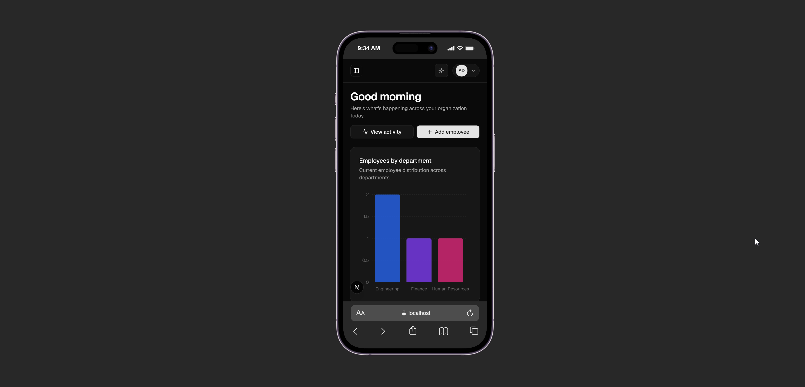
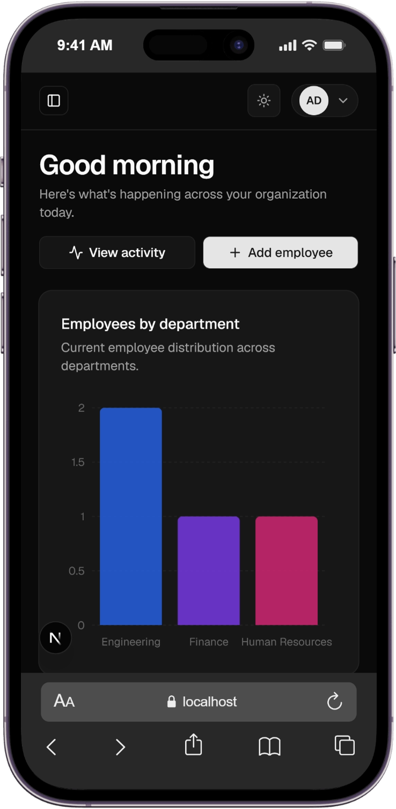
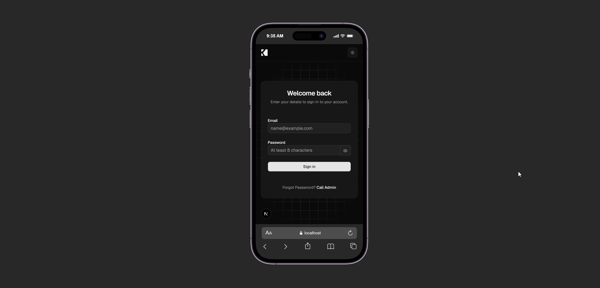

# Employee Management System — Frontend

Frontend for the Employee Management System (EMS), built with Next.js, React, TypeScript, Tailwind CSS, shadcn/Base UI, Recharts, and TanStack Query.

## Demo

**Live demo:** [ems.rayhancreative.web.id](https://ems.rayhancreative.web.id)

> The demo requires an active backend API that is accessible from the browser. If demo credentials are available, share them through a separate channel and do not store them in the repository.

## Main features

- Authentication: login, logout, session validation, and automatic redirects.
- Protected experience:
  - authenticated users who open `/login` are redirected to `/dashboard`;
  - application pages validate the current user through the `get-me` endpoint.
- Dashboard with employee summaries, department charts, employee status, and recent activity.
- Employee management:
  - list, search, filter, sort, and pagination;
  - detail, create, update, and soft-delete;
  - active/inactive status toggle;
  - CSV export.
- User management with roles loaded dynamically from the API.
- Department management with employee counts and status controls.
- Role-based access control (RBAC) with permission-gated navigation, pages, and actions.
- Role management with a database-backed permission catalog and role permission assignment.
- Audit logs with filtering, sorting, detail view, deletion, and CSV export.
- OpenAPI-based API documentation and request tester.
- Loading, skeleton, empty, error, toast, and responsive mobile states.
- TanStack Query for caching, refetching, and post-mutation cache invalidation.
- Dark mode and shadcn/Base UI components.

## Responsive design

<div style="display: flex; flex-wrap: wrap; gap: 6px;">
  
  
  
</div>

## Tech stack

- [Next.js](https://nextjs.org/) `16.3.6`
- React `19`
- TypeScript `5`
- Tailwind CSS `4`
- shadcn/Base UI
- `@tanstack/react-query`
- Recharts
- Lucide React
- ESLint

## Project structure

```bash
.
├── app
│   ├── (auth)
│   │   ├── login
│   │   └── logout
│   ├── (dashboard)
│   │   └── page
│   ├── (employees)
│   │   ├── page
│   │   └── [id]
│   ├── (departments)
│   │   └── page
│   ├── (users)
│   │   └── page
│   ├── (roles)
│   │   └── page
│   ├── (audit-logs)
│   │   └── page
│   └── (api-documentation)
│       └── page
├── components
├── lib
├── public
└── styles

```

## Prerequisites

Make sure the following are installed and available:

- An LTS version of Node.js compatible with Next.js 16.
- npm.
- A running and accessible EMS backend.
- The backend API URL and OpenAPI URL.

## Local setup

### 1. Clone the repository

```bash
git clone <repository-url>
cd ems-fe
```

### 2. Install dependencies

```bash
npm install
```

### 3. Create the environment file

Create a `.env.local` file in the project root:

```env
NEXT_PUBLIC_API_URL=http://localhost:8000/api/v1
NEXT_PUBLIC_API_DOCS_URL=http://localhost:8000/api-docs/openapi.json
```

| Variable                   | Description                                         |
| -------------------------- | --------------------------------------------------- |
| `NEXT_PUBLIC_API_URL`      | Backend API base URL without a trailing slash       |
| `NEXT_PUBLIC_API_DOCS_URL` | OpenAPI JSON URL used by the API Documentation page |

Do not commit secrets, access tokens, or production credentials to `.env.local`.

### 4. Run the development server

```bash
npm run dev
```

Open [http://localhost:3000](http://localhost:3000).

### 5. Run a local production build

```bash
npm run build
npm run start
```

The production server is available at [http://localhost:3000](http://localhost:3000), unless the port is changed by configuration or environment variables.

## Frontend routes

| Route                | Description                           | Access        |
| -------------------- | ------------------------------------- | ------------- |
| `/`                  | Redirect/landing entry point          | Public        |
| `/login`             | Login page                            | Public        |
| `/dashboard`         | System summary and charts             | `dashboard.read` |
| `/employees`         | Employee management                   | `employee.read` |
| `/departments`       | Department management                 | `department.read` |
| `/users`             | User management                       | `user.read` |
| `/roles`             | Role management                       | `role.read` |
| `/audit-logs`        | Audit logs                            | `audit_log.read` |
| `/api-documentation` | Mini API documentation/request tester | Authenticated |

## API endpoints

All paths below are relative to:

```text
${NEXT_PUBLIC_API_URL}
```

For example, `/employees` becomes `http://localhost:8000/api/v1/employees`.

### Authentication

| Method | Endpoint       | Description                          |
| ------ | -------------- | ------------------------------------ |
| `POST` | `/auth/login`  | Sign in and establish the session  |
| `GET`  | `/auth/get-me` | Get the currently authenticated user |
| `POST` | `/auth/logout` | Sign out and clear the session  |

The frontend sends requests with `credentials: "include"` and uses the backend HttpOnly session cookie. Tokens are not stored in `localStorage`.

### Role-based access control (RBAC)

The frontend reads the signed-in user's permissions from `GET /auth/get-me`. When the response includes `data.permissions`, that permission list is authoritative:

```json
{
  "success": true,
  "message": "success",
  "metadata": {},
  "data": {
    "id": "user-id",
    "email": "user@example.com",
    "status": true,
    "role": "HR",
    "permissions": ["dashboard.read", "employee.read", "employee.create"]
  }
}
```

The `useAuth()` hook exposes `can(permission)` to check access. The frontend uses it to show or hide sidebar links and protect pages using `*.read` permissions, gate create actions using `*.create`, and restrict exports using `employee.export` and `audit_log.export`. Data queries are not sent until authentication is restored and the required read permission is present. Users without read access see an access-restricted state.

Permission keys used by the application include:

```text
dashboard.read
user.read, user.create, user.update, user.delete
role.read, role.create, role.update, role.delete, role.permission.assign
department.read, department.create, department.update, department.delete
employee.read, employee.create, employee.update, employee.delete, employee.export
audit_log.read, audit_log.export
```

These frontend checks control the user experience only. The backend must enforce authorization on every endpoint.

#### Role permission management

The role management UI uses the following endpoints:

| Method | Endpoint | Permission | Description |
| ------ | -------- | ---------- | ----------- |
| `GET` | `/permissions` | `role.read` | List the permission catalog, including database IDs |
| `GET` | `/roles/:id/permissions` | `role.read` | List permissions currently assigned to a role |
| `PUT` | `/roles/:id/permissions` | `role.permission.assign` | Replace all permissions assigned to a role |

Permission assignment requires database IDs, not permission keys such as `employee.read`:

```json
{
  "permission_ids": ["permission-id-1", "permission-id-2"]
}
```

The frontend builds the checklist from `GET /permissions`, marks the role's current permissions from `GET /roles/:id/permissions`, and submits the selected IDs to the update endpoint. An empty `permission_ids` array removes every permission from the role. The built-in `ADMIN` role is protected from permission edits, updates, and deletion in the UI.

See [docs/rbac.md](./docs/rbac.md) for the frontend integration guide and [docs/rbac-endpoint.md](./docs/rbac-endpoint.md) for role endpoint details.

### Dashboard

| Method | Endpoint     | Description                                       |
| ------ | ------------ | ------------------------------------------------- |
| `GET`  | `/dashboard` | Get summary data, chart data, and recent activity |

### Employees

| Method   | Endpoint                         | Description                         |
| -------- | -------------------------------- | ----------------------------------- |
| `GET`    | `/employees`                     | List employees                      |
| `GET`    | `/employees/:id/detail`          | Get employee details                |
| `POST`   | `/employees/create`              | Create an employee; admin only      |
| `PUT`    | `/employees/:id/update`          | Update an employee; admin only      |
| `DELETE` | `/employees/:id/delete`          | Soft-delete an employee; admin only |
| `PATCH`  | `/employees/:id/status`          | Update employee status; admin only  |
| `GET`    | `/employees/export`              | Export employees as CSV             |
| `GET`    | `/employees/get-all-departments` | Get department options              |

Employee list parameters used by the frontend:

```text
page
per_page
q
status
department_id
position
hire_date_from
hire_date_to
sort_by
sort_order
```

Typical employee create/update payload:

```json
{
  "first_name": "Alex",
  "last_name": "Morgan",
  "email": "alex@example.com",
  "phone_number": "+628123456789",
  "department_id": "department-id",
  "position": "Software Engineer",
  "hire_date": "2026-01-15",
  "address": "Jakarta",
  "status": true
}
```

The `employee_code` is generated by the server and does not need to be sent by the frontend.

### Users

| Method   | Endpoint               | Description                     |
| -------- | ---------------------- | ------------------------------- |
| `GET`    | `/users`               | List users                      |
| `GET`    | `/users/get-all-roles` | Get roles for filters and forms |
| `POST`   | `/users/create`        | Create a user; admin only       |
| `PUT`    | `/users/:id/update`    | Update a user; admin only       |
| `PATCH`  | `/users/:id/status`    | Update user status; admin only  |
| `DELETE` | `/users/:id/delete`    | Soft-delete a user; admin only  |

### Departments

| Method   | Endpoint                  | Description                          |
| -------- | ------------------------- | ------------------------------------ |
| `GET`    | `/departments`            | List departments                     |
| `GET`    | `/departments/:id/detail` | Get department details               |
| `POST`   | `/departments/create`     | Create a department; admin only      |
| `PUT`    | `/departments/:id/update` | Update a department; admin only      |
| `PATCH`  | `/departments/:id/status` | Update department status; admin only |
| `DELETE` | `/departments/:id/delete` | Soft-delete a department; admin only |

### Roles

| Method   | Endpoint            | Description                    |
| -------- | ------------------- | ------------------------------ |
| `GET`    | `/roles`            | List roles                     |
| `GET`    | `/roles/:id/detail` | Get role details               |
| `POST`   | `/roles/create`     | Create a role; admin only      |
| `PUT`    | `/roles/:id/update` | Update a role; admin only      |
| `PATCH`  | `/roles/:id/status` | Update role status; admin only |
| `DELETE` | `/roles/:id/delete` | Soft-delete a role; admin only |

The `ADMIN` role cannot be deactivated from the UI.

### Audit logs

| Method   | Endpoint                 | Description              |
| -------- | ------------------------ | ------------------------ |
| `GET`    | `/audit-logs`            | List audit logs          |
| `DELETE` | `/audit-logs/:id/delete` | Delete an audit log      |
| `GET`    | `/audit-logs/export`     | Export audit logs as CSV |

Audit log parameters used by the frontend:

```text
page
per_page
q
action
entity
user_id
date_from
date_to
sort_by
sort_order
```

## Pagination response format

The frontend reads the total record count from `metadata.total_row` when available. The expected response shape is:

```json
{
  "success": true,
  "message": "Employees retrieved successfully",
  "metadata": {
    "per_page": 10,
    "current_page": 1,
    "total_row": 42,
    "total_page": 5
  },
  "data": []
}
```

## Access control

All API endpoints require authentication. Access is determined by permissions returned in `data.permissions` from `GET /auth/get-me`, not by role name alone. If that permission array is present, it takes precedence over the frontend's legacy role-based fallback.

Frontend restrictions improve the user experience but are not a security boundary. The backend must validate the required permission for every request.

## Testing, linting, and validation

The current `package.json` provides these scripts:

```bash
npm run lint
npm run build
```

### Run lint

```bash
npm run lint
```

### Run the TypeScript check

There is currently no dedicated script in `package.json`, so run:

```bash
npx tsc --noEmit
```

### Run production validation

```bash
npm run build
```

This validates Next.js compilation, TypeScript, static generation, and production optimization.

### Unit/integration tests

This repository currently does not include a test runner or an `npm test` script. Update this documentation with the appropriate command and test locations if a test runner is added.

## API Documentation

The API Documentation page loads its OpenAPI JSON from:

```env
NEXT_PUBLIC_API_DOCS_URL=http://localhost:8000/api-docs/openapi.json
```

After starting the application, open:

```text
http://localhost:3000/api-documentation
```

## Troubleshooting

### API requests fail or `NEXT_PUBLIC_API_URL is not configured` appears

Make sure `.env.local` exists in the project root and restart the development server after changing environment variables:

```bash
npm run dev
```

### The application redirects back to `/login`

Check the following:

- the backend is accessible from the browser;
- the `access_token` is still valid;
- `/auth/get-me` returns HTTP 200;
- the backend CORS configuration allows the frontend origin;
- backend cookies/session settings are configured correctly.

### Data does not appear even though the build succeeds

The build only validates the frontend. Make sure the backend is running, the base URL is correct, and API responses follow the documented format.

## Development notes

- Use the centralized API helper in `lib/api.ts`.
- Use TanStack Query for new server data so caching and invalidation remain consistent.
- Keep form, dialog, and filter state local unless it needs to be shared.
- Never put credentials or tokens in source code.
- After changing a major feature, run at least:

```bash
npx tsc --noEmit
npm run lint
npm run build
```

## License

No license has been specified for this project yet. Add a `LICENSE` file and update this section if the repository will be distributed publicly.
